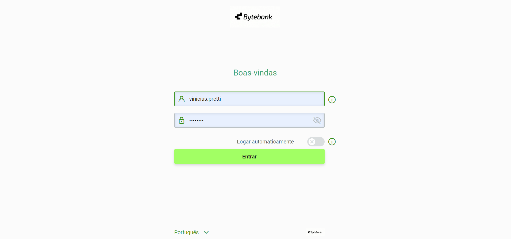
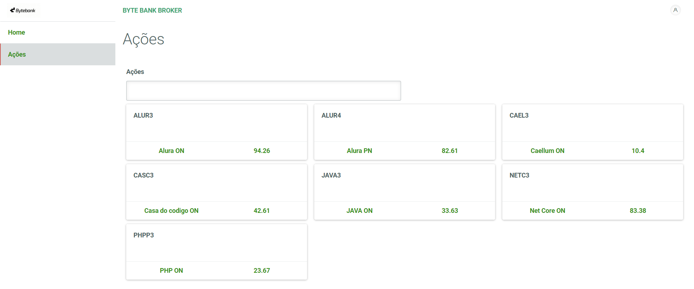

# Projeto ByteBank

- O projeto foi desenvolvido para testar a biblioteca Po-Ui e aplicar os conceitos do RxJs na requisição hhtp.

 

### ✌️ Para usar o projeto
- Usado node.js versão 14.21.3

* Abra a basta "byte-bank-broker" no cmd, no terminal digite: 

~~~npm
npm i
~~~

~~~npm
npm start
~~~

* Repita o mesmo processo para a pasta "api" para rodar o back-end

### 📌 Funcionalidades

- [x] Login e Logout de Usuário
- [x] Autenticação com Token
- [x] Filtragem de informações
- [x] Ordenação crescende do filtro aplicando as métricas do RxJs

### ⌨️ Tecnologias

As seguintes ferramentas foram usadas na construção do projeto:

- Angular 10
- Autenticação Jwt
- Biblioteca Po-Ui

### ⚠️ Atenção
Obs: A parte de back-end já peguei pronta, eu não desenvolvi.